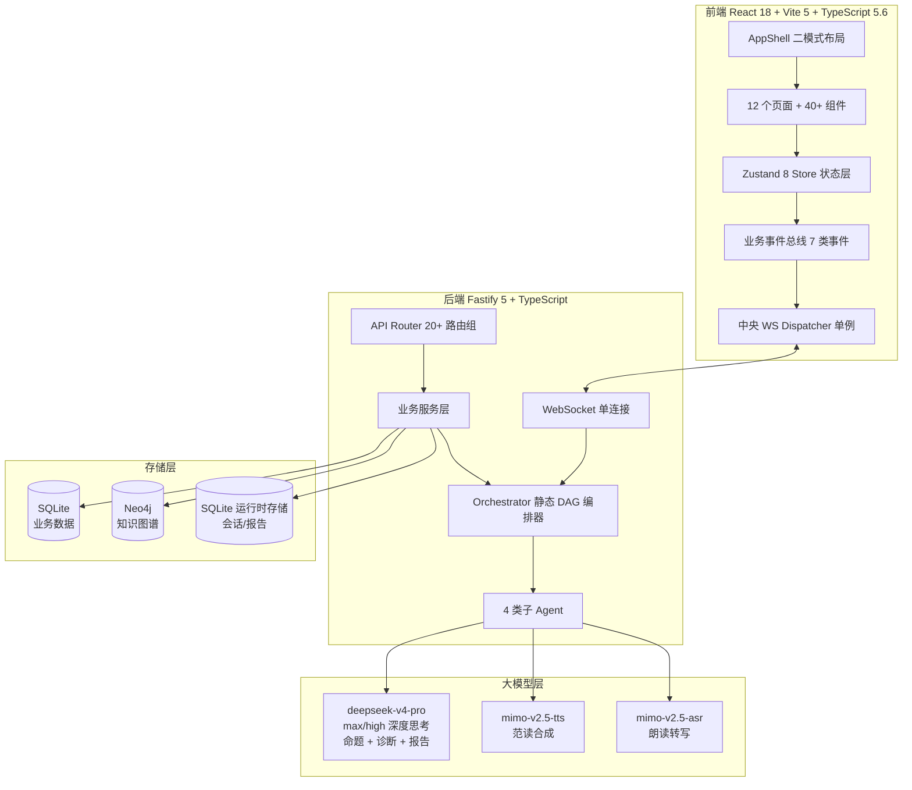

# 诗脉·启明 PoeticRealm AI v5.0

> **异构多智能体驱动的小学古诗词教学系统** —— 让每一首古诗都被深度理解，让每一位学生都被精准看见。

[]()
[]()
[]()

---

## 一、核心创新点

诗脉·启明是一套面向教学场景的**认知诊断与教学决策原型**。以下能力是当前版本重点验证的产品与技术设计；“原创性”及竞品差异仍需由可检索的对比证据支撑，不能只凭项目自述下结论：

### 1. 异构多智能体协作编排（Orchestrator + 4 类子 Agent + 静态 DAG）

系统后端运行一个 Orchestrator 编排器，通过静态有向无环图（DAG）协调命题、诊断、批改与报告等任务角色。Agent 调用具有超时、重试与本地降级路径；命题链路可为 DeepSeek 文本模型配置较高推理强度，进度通过 SSE 或 WebSocket 返回。真实耗时取决于模型、网络、限流与题量，提交材料只应引用带时间戳的现场实测数据。

### 2. 认知暗物质算法（自动检测学生六阶认知卡顿点）

借鉴天体物理学“暗物质”概念，系统通过分析学生作答时间序列、错误模式与修正轨迹，生成传统正确率统计之外的认知卡顿线索和推荐学习路径。当前结果用于教师端诊断与教学决策；项目尚未交付学生自学端，不能声称已经完成面向学生的自动推送。算法有效性还需要真实教学样本和外部专家评估。

### 3. 布卢姆修正版六阶认知模型（记忆/理解/应用/分析/评价/创造）

基于布卢姆认知目标分类学，结合小学古诗词教学场景修正为六阶：**记忆**（字词识记）、**理解**（句意把握）、**应用**（语境运用）、**分析**（手法辨析）、**评价**（审美判断）、**创造**（仿写改写）。六阶模型贯穿命题、批改、诊断、报告全链路，每个学生的认知画像以六维雷达图呈现，教师可一眼定位班级薄弱阶层。

### 4. 教师可治理的长期记忆（隐私优先）

长期记忆不是默认采集项。教师在设置面板中主动确认“内容已脱敏”后，才可保存教师偏好或绑定班级的学生学情摘要；系统按 `teacherId + classId + studentId` 做边界校验，任何未明确班级的学生查询或批量删除都会失败关闭。驾驶舱班级选择器与设置面板共享当前班级边界，避免跨模块误读旧班级。默认保留期为学生 180 天、教师偏好 365 天，并提供查看、修改、单条删除和按班级清空。手机号、身份证号、电子邮箱和访问密钥等直接标识符在正文和标签中都会被拒绝；注入 Agent 的历史内容会转义为不可信参考资料，不当作系统指令。

> 当前已由 Fastify 签发 HttpOnly HMAC 会话，并对写请求执行 CSRF/Origin 与 `teacherId` 会话绑定。默认 `AUTH_MODE=demo` 仍是公开演示档案，不证明现实教师身份；公网或真实学校数据部署必须切换密码/校园统一身份源、启用 TLS，并完成资源级权限审计。详见 `docs/adr/0001-server-authentication-boundary.md`。

---

## 二、快速开始

### 环境要求

| 依赖 | 版本 | 说明 |
|------|------|------|
| Node.js | 24.21.0 LTS（`>=24.11 <25`） | 前后端与部署环境统一锁定运行时；Node 20 已结束官方维护 |
| pnpm | 10.34.5（由 Corepack 锁定） | 前后端统一包管理器，锁文件与依赖构建许可纳入复现 |
| SQLite | 内置 | 业务数据存储，无需安装 |
| Neo4j | ≥ 5.x（可选） | 知识图谱存储，无则降级为内存图 |

### 安装与启动

首次使用先执行 `corepack enable`；仓库 `packageManager` 字段会固定 pnpm 10.34.5。不得改用无锁的 `npm install` 生成另一套依赖树。

参赛演示预检执行：

```powershell
node scripts/audit-api-contracts.mjs
node scripts/audit-production-dependencies.mjs
node scripts/audit-release-boundary.mjs
node scripts/competition-preflight.mjs --mode demo --deployment local --write
```

`提交材料/` 中的 Office 文件和 `scripts/refresh-submission-artifacts.py` 是早期参赛快照；脚本包含固定的旧测试数字，不能用于当前源码的软著或参赛材料。申请时按 `docs/audit/*-latest.json`、本次测试日志与 `docs/CURRENT_ARCHITECTURE_AND_COPYRIGHT.md` 重新编制材料，并由权利人核对署名、来源和哈希。

本地 LIVE 放行还要求实际运行时为 Node `>=24.11 <25` 与 pnpm 10.34.5，并使用 `AUTH_MODE=password`、至少 32 字符持久会话密钥和 scrypt 密码摘要；公开 demo 教师档案只允许 DEMO 演示，不能承载真实课堂数据。

当前代码的架构、证据边界与软著材料核对项见 [`docs/CURRENT_ARCHITECTURE_AND_COPYRIGHT.md`](./docs/CURRENT_ARCHITECTURE_AND_COPYRIGHT.md)。`docs/audit` 中带日期的报告是当时的快照，历史测试数字不能当作当前版本的回归结果。

禁止把整个工作目录直接复制为参赛包：其中可能包含本地 `.env`、日志和运行数据库。放行前先验证受控发布边界，再用白名单打包器在项目目录之外生成新目录：

```powershell
node scripts/prepare-competition-release.mjs --verify-only
node scripts/prepare-competition-release.mjs --out C:\competition-release\poetic-realm-release-20260801
```

打包器拒绝覆盖已有目录、拒绝符号链接、排除密钥/日志/数据库，并为发布文件生成 `RELEASE-MANIFEST.sha256.json`。`--verify-only` 仅在系统临时目录装配和复核，完成后自动删除临时包。

LIVE 放行还会检查两类不能由开发者伪造的外部证据：逐首古诗双信源/语文教师验收，以及经授权、脱敏、保留缺失样本的真实试点。试点 CSV 必须仅使用模板的最小化字段：每个完整前后测记录有窗口内的测量日期，每项指标保留相同匿名学生集合，缺失只能使用受控原因；准备证据时先运行：

```powershell
node scripts/audit-poem-provenance.mjs
node scripts/analyze-pilot-evidence.mjs --input <脱敏数据.csv> --manifest <试点清单.json> --out docs/audit/pilot-evidence-latest
```

前者会生成 148 首运行时诗集的逐首工作表；148 是收录量，不等于统编版必背口径。未完成外部验收时，工具、API 和前端均保持“待复核”，不会伪造通过。

该命令只输出凭据是否配置，绝不输出凭据原文；任何 `FAIL` 都必须先处理。

```bash
# 1. 克隆仓库
git clone <repo-url>
cd poetic-realm-v3

# 2. 启动后端（端口 3001）
cd backend
pnpm install --frozen-lockfile
cp ../.env.example .env   # 配置 DEEPSEEK_API_KEY / MIMO_API_KEY
pnpm dev

# 3. 启动前端（端口 5173）
cd ../frontend
pnpm install --frozen-lockfile
pnpm dev

# 4. 浏览器访问
open http://localhost:5173
```

### GitHub → Render 生产部署

仓库根目录已提供 `render.yaml`、冻结锁文件构建脚本和单一持久化数据根。Render 会由同一个 Fastify 服务托管 `frontend/dist`，并把 SQLite、批改上传、生成 WebP、朗诵录音和 TTS 缓存统一写入 `/var/data`。**Starter 或更高付费实例（下文简称 Starter+）是使用持久盘的最低部署边界**；Free 没有持久盘，其本地 SQLite 与上传文件会在休眠、重启或重新部署时丢失，不能作为比赛/生产部署。

完整的首次配置、秘密边界、GitHub 推送检查、域名/TLS/WebSocket/上传/生图/重启持久性验收见 [`DEPLOY_RENDER.md`](./DEPLOY_RENDER.md)。仓库只提供可复现配置，**不代表已经在 Render 控制台创建服务或完成真实公网验收**。

### 默认账号

| 角色 | 账号 | 密码 | 权限 |
|------|------|------|------|
| 教师演示身份 | `teacher-001` / 曹老师 | 固定演示手机号与口令（仅 `AUTH_MODE=demo` 的回环演示；以登录页配置为准） | 12 个教师导航模块 |

> 本版本只提供教师端。在线身份由 Fastify 签名 HttpOnly 会话验证；demo 只是公开演示主体，不等同现实教师身份。当前构建采用单教师本地租户，混入第二主体的数据会在启动期失败关闭；它不是校园多租户 RBAC。后端默认仅绑定 `127.0.0.1`，Compose 只把前端入口映射到宿主机回环地址，后端与 Neo4j 不发布宿主机端口。没有 TLS、学校身份源和逐资源多租户授权审计时，不得直接暴露到公网或不受信任局域网。

> 评审现场若无可用的 API Key，请在 `backend/.env` 显式设置 `DEMO_MODE=true`。核心页面、题库、课堂规则判分与报告具有本地降级；依赖真实模型的高质量生成、ASR/TTS 与在线生图不能被描述为已完成真实调用。

---

## 三、功能矩阵（12 个核心模块）

| 模块 | 路由 | 教学价值 | AI 能力 |
|------|------|----------|---------|
| 教学驾驶舱 | `/dashboard` | 班级预警、周进度、编排会话总览 | 多智能体编排会话实时推送 |
| 诗脉星图 | `/starmap` | 古诗知识图谱可视化、关联挖掘 | 图谱节点 AI 释义、一键靶向练习 |
| 命题工坊 | `/workbench` | 六阶权重命题、多智能体协作可视化 | 4 Agent 协作生成、题目微调 |
| 课堂导播台 | `/classroom` | 集体争霸/竞速 PK/飞花令/六阶沉浸 | 实时答题反馈、AI 助教提示 |
| 智能批改台 | `/grading` | 答题图片 OCR、认知归因、置信度 | 多模态批改、教师审核闭环 |
| 创作迭代台 | `/creation-studio` | 创作任务、作品审阅、反馈后再创作 | 多维批改、AI 协作标识 |
| AI 副驾 | `/ai-copilot` | 教学咨询、教案生成、学情问答 | deepseek-v4-pro 流式对话 |
| 教案工坊 | `/lesson-plan` | 十二类教案模板、教学环节骨架、多格式导出 | 教案生成、环节改写 |
| 进化之眼 | `/evolution-eye` | 题目基因谱、迭代轨迹可视化 | 多模态视觉标注 |
| 思考宫殿 | `/thinking-palace` | 推理链 3D 可视化、思考过程回放 | 思考强度分级、链路留痕 |
| 文化语境 | `/culture` | 历史背景、意象还原、沉浸投影 | 体裁分类色、意象图谱 |
| 教研报告 | `/report` | 班级诊断报告、教学建议 | AI 报告生成、Markdown 渲染 |

> 表中 12 条与 `frontend/src/config/nav.ts` 的教师导航逐条对齐；`/diagnosis` 等深层页由驾驶舱进入，不单独占导航位。
> 此前表内列出的 `/self-study`、`/recitation`、`/creation` 三项在路由表中并不存在，
> 而实际已交付的 `/lesson-plan`、`/evolution-eye`、`/thinking-palace` 反而未被收录，现已校正。

---

## 四、技术架构



---

## 五、演示场景（5 条教学故事线）

### 场景 1：三年级《静夜思》—— 李白意象理解卡顿诊断

教师在工作坊选择《静夜思》，系统生成六阶题目并进入课堂导播。学生作答后，驾驶舱的诊断页签展示六阶热力图与暗物质线索，教师据此生成下一轮靶向题目，形成“命题—作答—诊断—再命题”闭环。

### 场景 2：五年级《春晓》—— 飞花令擂台课堂模式

教师在课堂导播台选择"飞花令"模式，系统实时投影飞花令擂台。学生抢答含"花"字的诗句，AI 助教实时评分并更新排行榜。课堂结束后，系统自动生成教研报告，含参与率、正确率、认知阶层分布。

### 场景 3：四年级《登鹳雀楼》—— 六阶命题 + 自动批改

教师在命题工坊调整六阶权重（侧重"评价"阶层），生成 8 道题目。学生手写答题后拍照上传，批改台 OCR 识别 + 认知归因，标注"该生在'创造'阶层置信度 0.42，建议加强仿写训练"。

### 场景 4：六年级《水调歌头》—— 文化语境还原 + 教案联动

教师在文化语境页检索作品，查看时代背景、意象与关联诗篇，再回到教案工坊把语境材料编排进教学环节，避免把尚未交付的学生自学端写入演示脚本。

### 场景 5：课后复盘—— 课堂报告 + 下一步行动

教师结束课堂后生成课堂协奏报告，报告记录参与度、掌握度变化、亮点与改进项；再进入教研报告页形成可导出的行动清单。真实录音评测属于后端能力储备，不列入当前教师端的必走演示闭环。

---

## 六、大模型依赖

本系统的语言与语音能力使用 DeepSeek、MiMo 系列，教学插画可选用阿里云百炼 Wan 系列；均为国产模型服务。模型可用性、价格与数据条款以部署时的服务商合同为准。

| 模型 | 用途 | 调用方式 | 成本控制 |
|------|------|----------|----------|
| `deepseek-v4-pro` | 命题、诊断、报告、批改归因 | 可配置推理强度 | 以部署时服务商控制台为准 |
| `deepseek-v4-flash` | 流式对话、快速问答 | 可配置推理强度 | 以部署时服务商控制台为准 |
| `mimo-v2.5-tts` | 范读音频合成 | 按需调用 | 本地缓存减少重复请求 |
| `mimo-v2.5-asr` | 朗读录音转写 | 按需调用 | 限制单次录音时长与大小 |
| `wan2.7-image` | 教学插画生成 | 以百炼控制台为准 | 受控 Prompt + 本地落盘缓存 |

DeepSeek 与 MiMo 的文本调用可按供应商接口支持情况设置推理强度；TTS、ASR 与文生图不是同一种推理接口，不应概括为“所有模型调用均支持深度思考”。具体模型可用性、参数与价格必须在提交或部署当日复核。

---

## 七、技术栈

| 层 | 技术 | 版本 |
|----|------|------|
| 前端框架 | React | 18.3.1 |
| 构建工具 | Vite | 5.4.8 |
| 类型系统 | TypeScript（strict） | 5.6.2 |
| 样式方案 | Tailwind CSS + CSS Variables | 3.4.13 |
| 状态管理 | Zustand | 4.5.5 |
| 路由 | React Router DOM | 7.18.2 |
| 图表 | D3.js | 7.9.0 |
| 后端框架 | Fastify | 5.10 |
| 数据库 | better-sqlite3 + Neo4j | — |
| 图标 | Phosphor Icons | 2.1.7 |
| Markdown | react-markdown + remark-gfm | 9.1.0 |

---

## 八、性能指标

| 指标 | 目标 | 实测 |
|------|------|------|
| TypeScript 编译 | 0 错误 | ✅ 通过 |
| Vite 生产打包阶段 | ≤ 40s | ✅ 本轮复测 23.63–34.08s（同一审计机器；不含前置 TypeScript 检查） |
| 首次加载 JS（gzip） | ≤ 120KB | ✅ 93.259KB，余量 26.741KB（十进制、gzip level 9） |
| Lighthouse Performance | ≥ 90 | 未实测 |
| FCP | ≤ 1.0s | 未实测 |
| LCP | ≤ 1.8s | 未实测 |
| CLS | ≤ 0.03 | 未实测 |
| 动画帧率 | 60fps | 未实测 |
| 焦点可见（WCAG 2.4.7） | 全部可聚焦元素 | 全局样式已配置；生产 E2E 已实测首焦点跳转主内容，以及设置对话框的初始焦点、正反向焦点循环、Escape 关闭和焦点归还；仍缺全站屏幕阅读器与全部键盘路径人工验收 |
| 图标注册完整性 | 0 空白图标 | ✅ 125 个引用全部注册（原缺 20 个）|
| WS 连接数 | 1（单例） | ✅ 达标 |
| 业务事件同步延迟 | ≤ 50ms | 未实测 |

> **关于首屏 JS 体积**：治理前实测约 570KB（gzip），根因是
> `components/ui/index.ts` 这个 barrel 静态 re-export 了依赖 Three.js / ogl / GSAP /
> highlight.js 的组件，而 barrel 处于首屏依赖图中，导致页面里所有 `React.lazy`
> 全部失效、重型库被 `modulepreload` 进首屏。此外 `vite.config.ts` 被一份陈旧的
> 编译产物 `vite.config.js` 遮蔽，分包策略的修改长期不生效。
>
> 已完成的治理：修正配置遮蔽问题、将重型组件移出 barrel、DEMO 兜底数据改为惰性加载、
> 图标核心表按「常驻 chrome」严格收敛。当前初始 module script 与 modulepreload 的真实
> gzip 合计为 93.259KB，低于 120KB 项目预算 26.741KB；Three.js 等重型能力只按路由懒加载。这里的 120KB 是项目自设门禁，不冒充赛事官方阈值。
> 精确口径及每个入口文件见 `docs/audit/frontend-bundle-budget-latest.md`，不能用 DevTools
> 缓存后传输量或所有异步 chunk 总和替代该口径。

---

## 九、License

团队原创代码采用 MIT License © 2026 PoeticRealm AI Team。第三方组件、字体与设计来源保留各自上游条款，详见 [THIRD_PARTY_NOTICES.md](./THIRD_PARTY_NOTICES.md)。

---

## 十、致谢

- **布卢姆认知目标分类学** —— 六阶认知模型的理论基础
- **Phosphor Icons** —— 统一的 SVG 图标系统
- **Inter Variable Font** —— 界面排版字体
- **本地前端参考部件组** —— 仅作为交互研究资料；其来源并非已证实的单一上游，待核验组件与独立重写计划见 [`docs/audit/2026-08-09-frontend-reference-provenance.md`](./docs/audit/2026-08-09-frontend-reference-provenance.md)
- **Mem0 / Graphify** —— 长期记忆与关系置信度方法的设计参考
- **deepseek + mimo** —— 大模型能力支持
- **中央电化教育馆** —— "创 AI"案例征集平台
